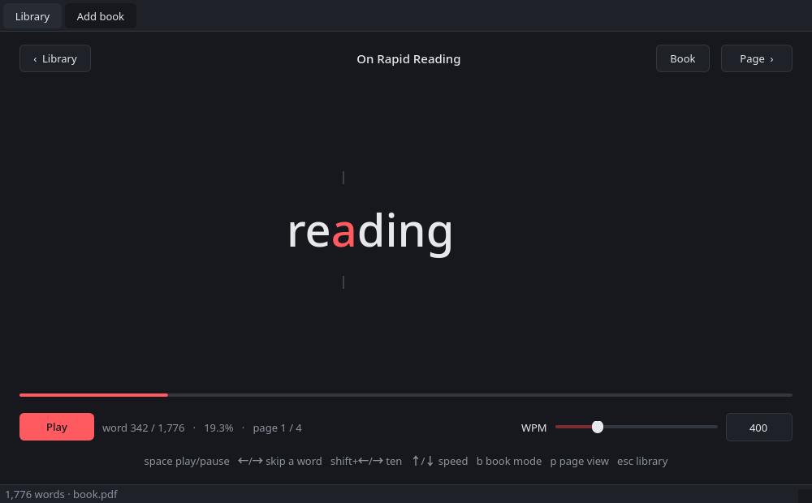
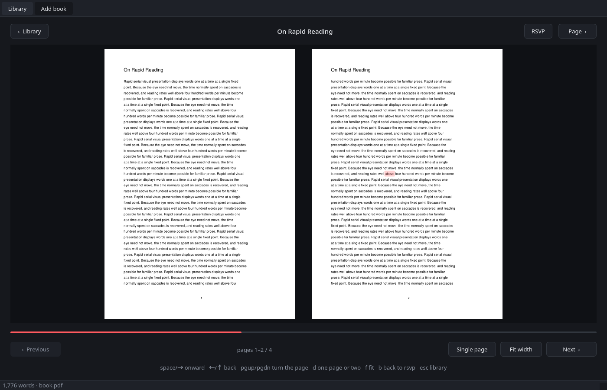
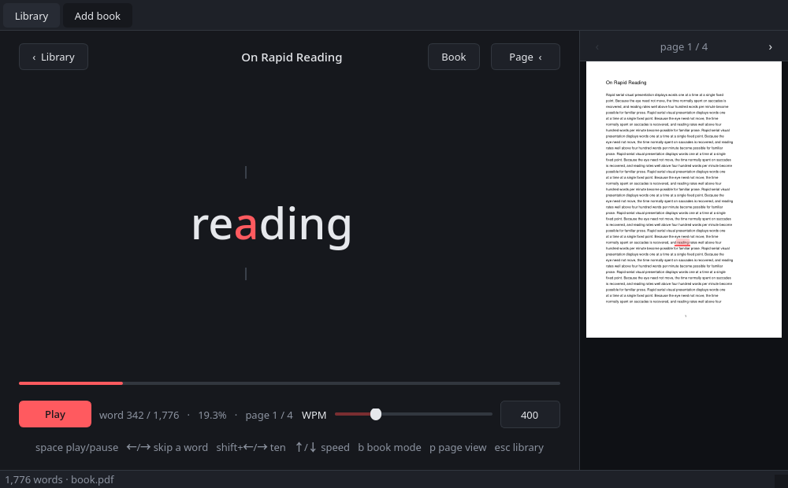

# RSVP Reader

**A local desktop speed reader.** Words from a document are flashed
one at a time at a fixed screen position, so your eyes never move across the
page. When you want to read normally instead, it opens as a two-page book.

[](LICENSE)
[](https://www.python.org/)
[](https://pypi.org/project/PyQt6/)
[](https://github.com/HawkOsm/rsvp-reader/actions/workflows/build.yml)

Each word is aligned by its **Optimal Recognition Point** — one letter,
slightly left of centre, is highlighted and pinned to the exact same pixel for
every word, so there is no horizontal drift to track.



### What it does

- **RSVP playback** at 50–1500 WPM, live-adjustable, with pacing that slows
  for long words, punctuation and paragraph breaks
- **ORP alignment** computed from real font metrics, so the focus letter lands
  on the same pixel for every word — no fixed-width assumptions
- **Book mode** — PDFs open as a real two-page spread; text files reflow into
  book-shaped columns
- **Page panel** showing the actual PDF page you are on, with your word
  highlighted, and click-to-jump
- **Library with resume** — SQLite-backed, remembers your place in every
  document and prompts to continue
- **Fully local.** No account, no cloud, no telemetry. Your files are never
  copied or uploaded.
- **Runs on Android too**, as a real installed app — see below

## On Android

A real, installed app — **[download rsvp-reader.apk](https://github.com/HawkOsm/rsvp-reader/releases/latest)**
from the latest release.

To install it, your phone has to be told to trust the file, because it does
not come from the Play Store:

1. Download the `.apk` on the phone (or copy it across)
2. Tap it. Android will say the app that opened it is not allowed to install
   apps — choose **Settings** and turn on *Allow from this source*
3. Go back and tap **Install**
4. Open **RSVP Reader**, tap **Add**, and pick a PDF or text file

Requires **Android 8.0 or newer**. It declares **no permissions at all** —
no network, no storage access — which CI checks on every build. Files are
read through Android's own document picker and never copied or uploaded.

The app is signed with the standard Android debug key, which is fine for
sideloading but means Play Protect may warn on first launch, and a future
build signed with a different key would need the old one uninstalled first.

### Or the web version

The same thing as an installable web page, if you would rather not sideload:
**[hawkosm.github.io/rsvp-reader](https://hawkosm.github.io/rsvp-reader/)**

Open it on your phone, then *Add to Home Screen* (iOS Safari) or *Install
app* (Android Chrome). It runs full-screen with no browser chrome, works
offline, and keeps your library on the device. **This is the only option on
iPhone** — Apple does not permit sideloading.

*(Open the link above on a phone to try it — there is nothing to install
and nothing to sign up for.)*

- Tap the middle to play or pause, the left and right edges to step a word
- Drag the progress bar to scrub
- **Page** shows the real PDF page with your word highlighted
- Your files and reading positions never leave the device — there is no
  server, no account, and nothing is uploaded

It works in a desktop browser too. It is a separate implementation in
`web/`, not a port of the Python: the ORP, pacing and tokenising rules are
reimplemented in JavaScript and **verified to produce identical output** to
the Python version, so both read at the same rhythm.

To run it locally:

```bash
python serve.py          # http://localhost:8770
```

## Download

Prebuilt, self-contained binaries for Linux, Windows and macOS are attached to
each [release](https://github.com/HawkOsm/rsvp-reader/releases). They need no
Python installed. They are **unsigned**, so Windows SmartScreen and macOS
Gatekeeper will warn on first run.

Or run from source, which works on all three:

## Requirements

- Python 3.10 or newer
- [PyQt6](https://pypi.org/project/PyQt6/) and
  [PyMuPDF](https://pypi.org/project/PyMuPDF/) — both ship wheels for Linux,
  Windows and macOS

## Install & run

```bash
git clone https://github.com/HawkOsm/rsvp-reader.git
cd rsvp-reader
python -m venv .venv
```

Then, on **Linux / macOS**:

```bash
.venv/bin/pip install -r requirements.txt
.venv/bin/python main.py
```

On **Windows**:

```powershell
.venv\Scripts\pip install -r requirements.txt
.venv\Scripts\python main.py
```

On Arch you can use the system packages instead:
`pacman -S python-pyqt6 python-pymupdf`

> **Platform support, honestly stated.** The code is platform-neutral — it uses
> `pathlib` throughout, has font fallbacks for all three systems, and both
> dependencies ship wheels everywhere. CI builds and smoke-tests binaries on
> all three. But it is developed and used daily on Linux, which is the only
> platform it has had real-world use on. Bug reports from Windows and macOS
> are welcome.

## Building a binary yourself

```bash
pip install pyinstaller
python tools/make_icons.py
pyinstaller --clean --noconfirm rsvp-reader.spec
```

The result lands in `dist/`. It is around 100 MB, because it bundles the whole
Qt runtime — that is the going rate for a self-contained Qt application.

You can also pass files straight in: `python main.py ~/books/essay.pdf`,
or `rsvp-reader ~/books/essay.pdf` once installed (see below).

## Adding it to your applications

```bash
./install.sh
```

That puts **RSVP Reader** in your desktop application menu with an icon, and
`rsvp-reader` on your `PATH`. It uses the freedesktop standard, so it works on
GNOME, KDE, XFCE, Sway, Hyprland and the rest. (Linux only — on Windows and
macOS use a released binary, or run from source.) Nothing is copied but the icon — the menu entry
points at this directory, so edits here take effect immediately. Everything
lands under `~/.local`; no root needed.

The entry deliberately claims **no file types**, so it cannot become your
default PDF opener. If you do want it offered under "Open With":

```bash
./install.sh --associate
```

That pins your existing defaults first, so adding this app cannot quietly
take them over. To remove everything again (your library is left alone):

```bash
./install.sh --uninstall
```

## Adding a book

Three ways, all equivalent:

- **Add book…** in the toolbar or on the Library screen (`Ctrl+O`)
- **Drag and drop** a file anywhere onto the window
- Name it on the command line

Supported formats are `.txt` (plus `.md`, `.rst`, `.org`) and `.pdf`. PDF text
is extracted with PyMuPDF; words broken across lines by a hyphen are rejoined,
and blank lines are treated as paragraph breaks.

Click any row in the Library to start reading it. Right-click a row for
**Reset progress** and **Remove from library**.

A PDF that is a pure scan has no text layer to extract, so it is rejected with
a message rather than opening empty — it would need OCR first.

## Reading normally: book mode

RSVP is one way to read, not the only one. Press **B** (or the **Book**
button) and the document opens as a **two-page spread**, left and right, the
way a book sits open.



- **PDFs show their real pages**, rendered as typeset — original layout,
  figures, columns and all.
- **Text files are reflowed** into book-shaped columns, since they have no
  real pages to show.
- **Single page** swaps the spread for one page at a time.
- **Fit width** fills the width and lets you scroll down a page; **Fit page**
  shows the whole thing at once. (PDFs only — reflowed text always fits.)
- The word you were on stays highlighted, and **switching back to RSVP
  resumes from exactly where the book left you** — turning pages moves your
  place, so you can read a few pages by eye and then hit **B** to carry on
  word-at-a-time.

## The page panel

RSVP strips a document down to a stream of words, which makes it easy to lose
your bearings. Press **P** (or the **Page ›** button) and a panel slides out
from the right showing the actual PDF page you are on, with the current word
highlighted on it.



- It **follows along** as you read, turning pages by itself.
- **Click any word on the page** to jump the reader there.
- **‹ / ›** in the panel header step a page at a time.
- **Drag the divider** to make the page bigger; it re-renders at the new size.
- The panel remembers whether you left it open.

Even with the panel closed, the word counter reads
`word 746 / 1,776 · 42.0% · page 2 / 4`.

Plain text files have no pages, so the button is disabled for them.

## Keyboard shortcuts

| Key | Action |
| --- | --- |
| `Space` | Play / pause |
| `←` / `→` | Back / forward one word |
| `Shift`+`←` / `→` | Back / forward ten words |
| `↑` / `↓` | Speed up / down by 25 WPM |
| `Home` / `End` | Jump to start / end |
| `P` | Show / hide the page panel |
| `B` | Book mode / back to RSVP |
| `Esc` | Back to the library |
| `Ctrl+L` | Library |
| `Ctrl+O` | Add book |
| `Ctrl+Q` | Quit |

In book mode the keys change to suit reading:

| Key | Action |
| --- | --- |
| `Space` / `→` / `↓` | Onward — down a tall page, then turn it |
| `←` / `↑` | Back the same way |
| `PgUp` / `PgDn` | Turn the page regardless |
| `Home` / `End` | First / last page |
| `D` | One page or two |
| `F` | Fit width / fit page |

The progress bar is clickable and draggable — scrub it to jump anywhere in the
document. WPM is live-adjustable while playing; the new rate takes effect on
the next word.

## Resuming

Your position is written to disk every 20 words, and again whenever you pause,
go back to the library, or close the app. Re-opening a book you are partway
through asks whether to **Resume**, **Start over**, or **Cancel**.

## Pacing

Base delay is `60000 / WPM` milliseconds per word, adjusted by:

| Condition | Effect |
| --- | --- |
| Word longer than 6 characters | `+30 ms` per extra character |
| Ends in `,` `;` `:` `—` | × 1.5 |
| Ends in `.` `!` `?` `…` | × 2.5 |
| Last word of a paragraph | `+350 ms` flat |

Trailing quotes and brackets are looked past, so `said."` still counts as a
sentence end. The constants live at the top of `rsvp_engine.py`.

## Where your data lives

A single SQLite file, in the place each system expects:

| Platform | Location |
| --- | --- |
| Linux | `~/.config/rsvp-reader/library.db` (`$XDG_CONFIG_HOME` honoured) |
| Windows | `%APPDATA%\rsvp-reader\library.db` |
| macOS | `~/Library/Application Support/rsvp-reader/library.db` |

It holds:

- `books` — one row per file: path, title, total words, last word index,
  timestamps, and a `fingerprint` of the source file
- `tokens` — the precomputed word list per book, so re-opening a large PDF
  never re-parses it. For PDFs each row also stores the word's page number
  and its rectangle on that page, which is what the page panel draws with.

The fingerprint is `v<cache version>:<mtime>:<size>`. If a source file changes
on disk, or the token format itself changes in a new version, the fingerprint
stops matching and the tokens are rebuilt automatically on next open — your
reading positions are kept. Databases from an earlier version have the newer
columns added in place on first run. Deleting the database loses your
library and reading positions; the source documents are never touched or
copied.

## Layout

| File | Purpose |
| --- | --- |
| `main.py` | Entry point: app, theme, database, window |
| `db.py` | SQLite schema and CRUD |
| `text_extract.py` | PDF/text → token list, punctuation attached |
| `pdf_render.py` | Renders PDF pages to images for the panel |
| `rsvp_engine.py` | QTimer playback: pacing, ORP index, seek/pause |
| `ui/library_view.py` | The library table |
| `ui/reader_view.py` | RSVP display widget and transport controls |
| `ui/page_view.py` | The sliding page panel |
| `ui/book_view.py` | Book mode: page spreads and text reflow |
| `ui/main_window.py` | Wires the two views together |
| `ui/style.py` | Dark palette and stylesheet |
| `tools/make_icons.py` | Renders the SVG into .png / .ico / .iconset |
| `serve.py` | Serves the web app locally for development |
| `web/js/rsvp.js` | The engine, ported to JavaScript |
| `web/js/text.js` | Tokenizer, plus PDF.js word extraction |
| `web/js/library.js` | The library, in IndexedDB |
| `web/js/app.js` | Touch UI, canvas ORP drawing, page view |
| `android/` | The native Android app, in Kotlin |
| `android/…/Rsvp.kt` | The engine, ported to Kotlin |
| `android/…/PdfText.kt` | Word positions via PDFBox-Android |
| `android/…/Library.kt` | The library, in SQLite |
| `rsvp-reader.spec` | PyInstaller build definition |

## Contributing

Issues and pull requests are welcome. The code aims for clarity over
cleverness — matching the surrounding style matters more than being clever.
There is no build step: edit, then `.venv/bin/python main.py`.

`.venv/bin/python -m pyflakes *.py ui/*.py` should stay clean.

## Licence

**GNU General Public License v3.0 or later** — see [LICENSE](LICENSE).

You may use, study, share and modify this program freely. If you distribute a
modified version, you must release your source under the same licence, so that
whoever receives it keeps the same freedoms.

This is not merely a preference. The app depends on:

| Dependency | Licence |
| --- | --- |
| [PyQt6](https://pypi.org/project/PyQt6/) | GPL-3.0-only (or a commercial Riverbank licence) |
| [PyMuPDF](https://pypi.org/project/PyMuPDF/) | AGPL-3.0 (or a commercial Artifex licence) |

A permissive licence such as MIT would therefore have been misleading: it would
advertise a freedom to ship this inside closed software that the dependencies
do not actually grant. If you need that, you would have to buy commercial
licences from Riverbank and Artifex and replace this project's own terms.

### Distributing binaries

The released binaries bundle PyQt6 and PyMuPDF, so each one is a combined work
covered by the GPL and AGPL. Their complete corresponding source is this
repository at the matching tag, and the build is reproduced with
`pyinstaller rsvp-reader.spec` against `requirements.txt`. If you redistribute
a binary elsewhere, you must carry that source offer with it.

Copyright © 2026 Osman Sahin Guler.
